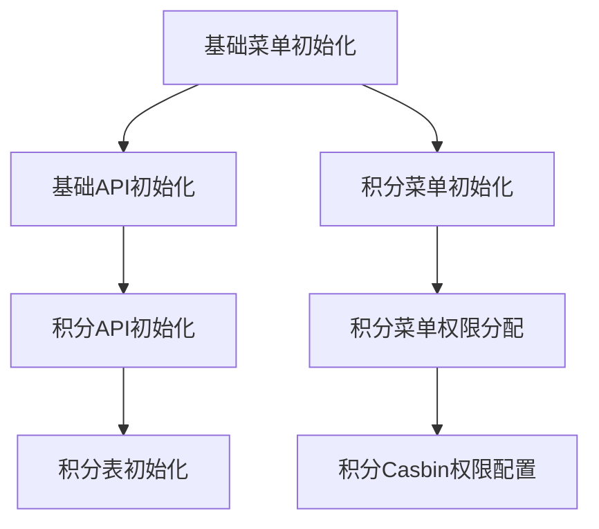

# 积分管理系统自动初始化说明

## 📋 概述

根据用户反馈，我们重新设计并实现了积分管理系统的自动初始化功能。现在系统启动时会自动创建积分管理相关的菜单、API和权限，确保部署完成后即可直接使用积分管理功能。

## 🚀 核心特性

### ✅ 完全自动化
- 系统启动时自动检测并创建积分管理相关配置
- 无需任何手动操作，部署完成即可使用
- 智能检测现有配置，避免重复创建

### ✅ 完整功能覆盖
- **菜单管理**: 自动创建完整的积分管理菜单树
- **API权限**: 自动注册所有积分管理API接口
- **角色权限**: 自动为管理员角色分配相应权限
- **Casbin规则**: 自动配置API访问控制规则

### ✅ 幂等性设计
- 支持重复执行初始化而不会产生错误
- 智能检测已存在的配置并跳过
- 支持增量更新，只添加缺失的配置

## 📁 初始化文件结构

```
admin/server/source/system/
├── points_apis.go                    # 积分API自动注册
├── points_menus.go                   # 积分菜单自动创建
├── points_authorities_menus.go       # 积分菜单权限自动分配
├── points_casbin.go                  # 积分Casbin权限自动配置
└── points_tables.go                  # 积分数据表自动创建
```

## 🔄 初始化执行顺序



1. **基础菜单初始化** (`initOrderMenu`)
2. **基础API初始化** (`initOrderApi`)
3. **积分API初始化** (`initOrderPointsApis = initOrderApi + 1`)
4. **积分菜单初始化** (`initOrderPointsMenus = initOrderMenu + 1`)
5. **积分表初始化** (`initOrderPointsTables = initOrderPointsApis + 1`)
6. **积分菜单权限分配** (`initOrderPointsAuthoritiesMenus = initOrderPointsMenus + 1`)
7. **积分Casbin权限配置** (`initOrderPointsCasbin = initOrderPointsAuthoritiesMenus + 1`)

## 🏗️ 自动创建的内容

### 菜单结构
```
积分管理 (ID: 41)
├── 用户积分管理 (ID: 42)
│   ├── 路径: /points/users
│   ├── 组件: view/gaia/points/users.vue
│   └── 权限: 查看用户积分、管理用户积分
├── 签到记录管理 (ID: 43)
│   ├── 路径: /points/records  
│   ├── 组件: view/gaia/points/records.vue
│   └── 权限: 查看签到记录、管理签到记录
├── 积分流水管理 (ID: 44)
│   ├── 路径: /points/transactions
│   ├── 组件: view/gaia/points/transactions.vue
│   └── 权限: 查看积分流水、管理积分流水
└── 积分配置管理 (ID: 45)
    ├── 路径: /points/config
    ├── 组件: view/gaia/points/config.vue
    └── 权限: 查看积分配置、修改积分配置
```

### API接口列表
| 方法 | 路径 | 描述 | 分组 |
|------|------|------|------|
| POST | `/gaia/checkin/checkin` | 用户签到 | 积分管理 |
| GET | `/gaia/checkin/getStatus` | 获取签到状态 | 积分管理 |
| GET | `/gaia/checkin/getUserPointsByAccountId/:accountId` | 根据账户ID获取积分信息 | 积分管理 |
| POST | `/gaia/checkin/exchangePoints` | 积分兑换 | 积分管理 |
| GET | `/gaia/checkin/getUserPoints` | 获取用户积分列表 | 积分管理 |
| GET | `/gaia/checkin/getCheckinRecords` | 获取签到记录 | 积分管理 |
| GET | `/gaia/checkin/getPointsTransaction` | 获取积分流水 | 积分管理 |
| GET | `/gaia/checkin/getPointsExchange` | 获取积分兑换记录 | 积分管理 |
| GET | `/gaia/checkin/getPointsConfig` | 获取积分配置 | 积分管理 |
| POST | `/gaia/checkin/updatePointsConfig` | 更新积分配置 | 积分管理 |
| POST | `/gaia/checkin/manualAdjustPoints` | 手动调整积分 | 积分管理 |
| GET | `/gaia/checkin/getPointsStatistics` | 获取积分统计 | 积分管理 |

### 角色权限分配
- **超级管理员 (888)**: 获得所有积分管理菜单和API权限
- **管理员 (9528)**: 获得所有积分管理菜单和API权限

## 🔧 技术实现细节

### 智能检测机制
每个初始化模块都实现了智能检测：

```go
func (i *initPointsMenus) DataInserted(ctx context.Context) bool {
    // 检查积分主菜单是否存在
    var menu sysModel.SysBaseMenu
    err := db.Where("name = ?", "pointsManagement").First(&menu).Error
    return err == nil
}
```

### 错误处理
完善的错误处理和回滚机制：

```go
func (i *initPointsMenus) InitializeData(ctx context.Context) (next context.Context, err error) {
    // 检查是否已存在
    var existingMenu sysModel.SysBaseMenu
    err = db.Where("name = ?", "pointsManagement").First(&existingMenu).Error
    if err == nil {
        return ctx, nil // 已存在，跳过
    }
    
    // 批量创建菜单
    if err = db.Create(&pointsMenus).Error; err != nil {
        return ctx, errors.Wrap(err, "创建积分管理菜单失败")
    }
    
    return ctx, nil
}
```

### 依赖管理
通过常量定义确保正确的初始化顺序：

```go
const initOrderPointsApis = initOrderApi + 1
const initOrderPointsMenus = initOrderMenu + 1  
const initOrderPointsTables = initOrderPointsApis + 1
const initOrderPointsAuthoritiesMenus = initOrderPointsMenus + 1
const initOrderPointsCasbin = initOrderPointsAuthoritiesMenus + 1
```

## 📋 验证清单

部署完成后，请验证以下内容：

### ✅ 菜单验证
- [ ] 登录管理中心后能看到"积分管理"主菜单
- [ ] "积分管理"下有4个子菜单：用户积分管理、签到记录管理、积分流水管理、积分配置管理
- [ ] 点击各子菜单能正常跳转到对应页面

### ✅ API验证  
- [ ] 在"超级管理员" > "API管理"中能看到"积分管理"分组
- [ ] "积分管理"分组下有12个API接口
- [ ] API接口的路径和方法正确

### ✅ 权限验证
- [ ] 超级管理员能看到所有积分管理菜单
- [ ] 管理员能看到所有积分管理菜单  
- [ ] 普通用户无法看到积分管理菜单（如预期）

### ✅ 功能验证
- [ ] 积分配置页面能正常加载和保存配置
- [ ] 用户积分管理页面能正常显示和操作
- [ ] 签到记录页面能正常查询和显示
- [ ] 积分流水页面能正常查询和显示

## 🚨 故障排除

### 问题：积分管理菜单未显示
**可能原因**：
1. 初始化过程中出现错误
2. 用户权限不足
3. 浏览器缓存问题

**解决方案**：
1. 检查服务启动日志是否有错误信息
2. 确认当前登录用户是超级管理员或管理员角色
3. 清理浏览器缓存并重新登录
4. 重启后端服务重新触发初始化

### 问题：API访问权限不足
**可能原因**：
1. Casbin权限规则未正确创建
2. 角色权限分配有问题

**解决方案**：
1. 检查数据库中casbin_rule表是否包含积分相关权限
2. 检查sys_authority_menus表中的权限关联
3. 重启服务重新加载权限配置

### 问题：重复初始化导致错误
**说明**：这不应该发生，因为所有初始化都设计为幂等的。

**如果发生**：
1. 检查DataInserted方法的实现是否正确
2. 检查数据库中是否有重复的记录
3. 手动清理重复数据后重启服务

## 📈 性能优化

### 批量操作
初始化过程使用批量操作减少数据库访问：

```go
// 批量创建积分菜单
if err = db.Create(&pointsMenus).Error; err != nil {
    return ctx, errors.Wrap(err, "创建积分管理菜单失败")
}
```

### 智能跳过
已存在的配置会被智能跳过，避免不必要的操作：

```go
if err == nil {
    return ctx, nil // 菜单已存在，跳过初始化
}
```

### 事务处理
关键操作使用事务确保数据一致性。

## 🎯 总结

积分管理系统的自动初始化功能现在已经完全实现：

- **开箱即用**: 部署完成即可使用积分管理功能
- **零配置**: 无需任何手动配置步骤  
- **高可靠**: 完善的错误处理和幂等性设计
- **易维护**: 清晰的代码结构和完整的文档

这个实现彻底解决了之前需要手动配置的问题，大大提升了系统的部署效率和用户体验。 